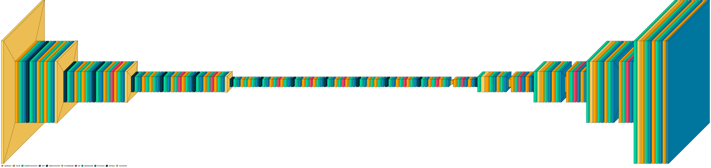
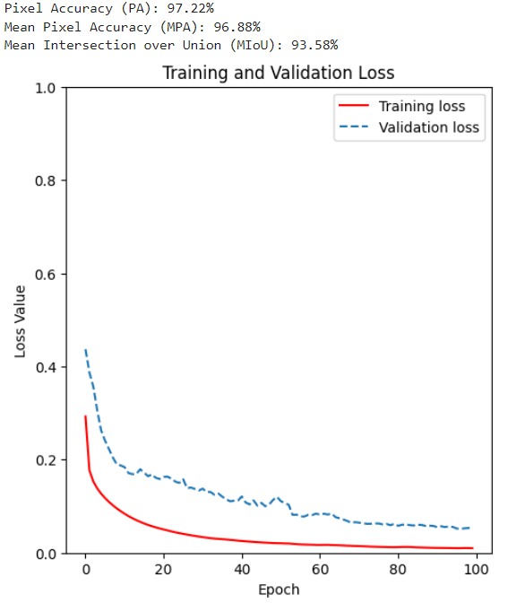
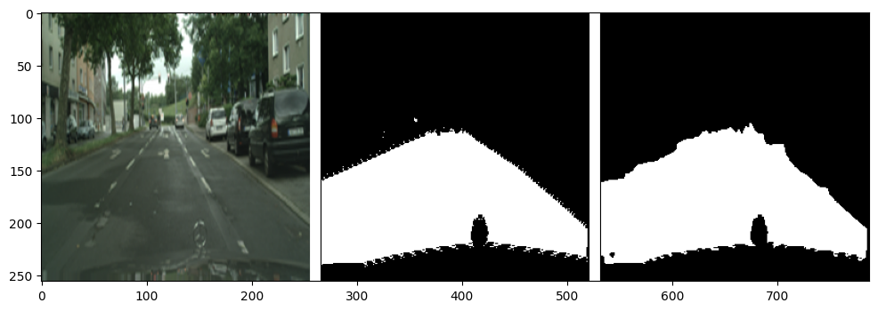
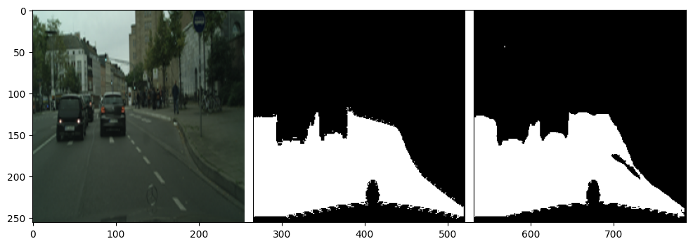
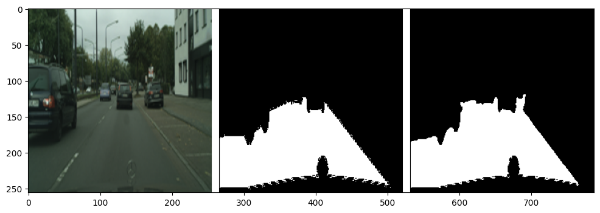
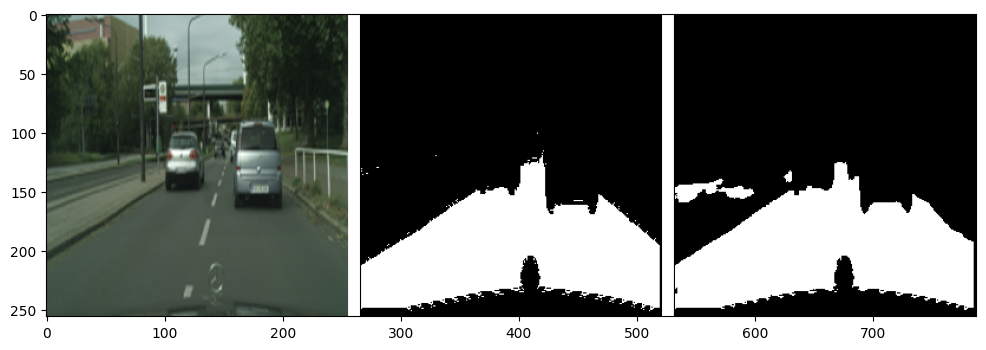

# Semantic-Segmentation-with-Self-Attention-in-U-Net-Architecture
This repository contains a project completed at Worcester Polytechnic Institute for the CS-541 Deep Learning course.

# Problem Description 
In this project, we aim to segment the drivable area from an urban city environment for an autonomous vehicle. We have used the [CityScapes](https://www.cityscapes-dataset.com/) dataset to train and validate the model. 

# Model Architecture and Description
The image below shows the architecture used to segment the drivable area from an input image.

The above model represents a U-Net Architecture with MobilenetV2 as the pre-trained encoder. Transfer Learning is employed to train the model on the dataset images. A bottleneck is created which allows us to focus on the crucial features and is passed to a self-attention mechanism used in the Decoder along with up-sampling and pooling layers. 

# Results
The below results have been obtained from the model described above:

## Output

